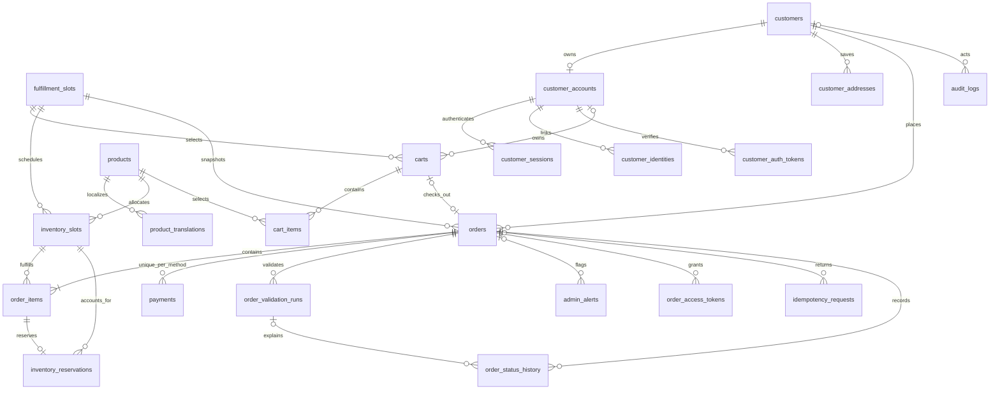

# Phase 1 - Kết quả review song song và quyết định kiến trúc

Ngày: 2026-09-10. Trạng thái: schema đã được người dùng phê duyệt và triển khai trong [Phase 2](phase_2_foundation.md). Các gate runtime còn mở vẫn áp dụng; xem [lộ trình hiện tại](README.md). [Phase 3.2](phase_3_2_customer_auth.md) đang triển khai phần auth local, chưa hoàn tất OAuth hoặc production gates.

Review thiết kế ban đầu dùng hai agent độc lập, chỉ đọc. Agent A kiểm tra domain/database; Agent B kiểm tra concurrency/worker. Lead đối chiếu schema legacy, loại trùng và tổng hợp khuyến nghị dưới đây. Phần review thiết kế không sửa code hoặc migration; kết quả triển khai được ghi riêng theo phase.

Đây là tài liệu quyết định chuẩn, thay thế bản schema nháp đã loại bỏ. Các khác biệt lịch sử được giữ ở mục 8. Approval schema không tự phê duyệt các mục OPEN hoặc cho phép bật flow chưa qua gate.

Trong trường hợp tài liệu gốc còn khác biệt, dùng các quyết định được tổng hợp tại đây để duyệt bản thiết kế cuối. Nguồn yêu cầu: 13 nhóm của `phase_1_suggest.md` đã đọc đầy đủ trong cuộc trao đổi trước và checklist 13 bước mới nhất của người dùng. File suggest hiện không còn trên đĩa tại thời điểm rà soát này; ma trận ở mục 9 ghi lại đủ 13 nhóm để tài liệu không phụ thuộc một liên kết bị thiếu. Mặc định người dùng đã chốt được giữ nguyên; chỉ các giá trị chưa có quyết định mới để mở. Lần cập nhật này chỉ sửa tài liệu review, không chạy lại hai agent hoặc kiểm thử runtime.

## 1. Kết luận và xử lý bất đồng

Ba điểm đã chỉnh trong bản gốc là đúng: fulfillment ở cấp cart/order; reservation và counter cập nhật nguyên tử; VI/EN qua `product_translations`. Không mở lại các quyết định này.

Agent A trả hai vấn đề: nguồn slot chuẩn (BLOCKER), ràng buộc COD (IMPORTANT). Agent B trả bốn vấn đề IMPORTANT: idempotency đồng thời, cart snapshot, thứ tự event, outbox retry/liveness. Không có finding trùng hoàn toàn; cart snapshot liên quan fulfillment nhưng là một race riêng.

Lead điều chỉnh đánh giá slot thành IMPORTANT trong giai đoạn thiết kế: cấu hình tĩnh có kiểm soát cũng có thể làm nguồn chuẩn, nên thiếu một bảng chưa chứng minh hệ thống sai. Tuy nhiên phải chọn nguồn trước khi triển khai checkout. Khuyến nghị một bảng nhỏ `fulfillment_slots` vì cần FK và quản lý vòng đời; không cần slot microservice.

Lead giữ event version/refetch nhưng không thêm bảng watermark tổng quát lúc này. Các consumer cập nhật projection mới cần watermark nếu được bổ sung sau. Không chọn SERIALIZABLE toàn hệ thống, không tách database theo module và không dùng distributed transaction.

## 2. Bảng quyết định tổng hợp

| Khu vực | Thiết kế hiện tại | Vấn đề / tình huống lỗi | Quyết định đề nghị | Mức độ |
| --- | --- | --- | --- | --- |
| Slot chuẩn (A) | Có slot_key và snapshot, chưa có nguồn chuẩn | Chấp nhận key tùy ý hoặc không biết giờ giao để snapshot | Thêm fulfillment_slots, FK cho cart/inventory/order; snapshot bất biến | IMPORTANT |
| COD (A) | Một obligation/đơn mô tả bằng lời | Retry tạo hai payment hoặc số tiền khác đơn | UNIQUE(order_id, method) theo người dùng; chỉ COD được bật; kiểm tra amount/currency cùng transaction | IMPORTANT |
| Idempotency (B) | Unique scope/key, lưu response cùng đơn | Hai request cùng key va chạm trong transaction | Claim bằng conflict-safe insert trước nghiệp vụ; bên thua đọc kết quả đã commit bằng statement mới | IMPORTANT |
| Cart snapshot (B) | Có version nhưng checkout chưa khóa rõ | Items và slot thuộc hai version khác nhau | Khóa cart, kiểm tra expected_version, đọc items sau khóa, đóng cart trong transaction tạo đơn | IMPORTANT |
| Event ordering (B) | Có event_id và aggregate_version | Event cũ khác ID đến sau event mới | Event là tín hiệu; đọc state hiện hành, không áp payload cũ để đảo trạng thái | IMPORTANT |
| Outbox liveness (B) | Có lease và thời điểm retry | Broker lỗi gây hot-loop hoặc backlog không ai biết | Backoff có cap/jitter; lease token chống stale publisher; metric và cảnh báo backlog | IMPORTANT |
| Retry sau rollback (Lead) | Ghi retry riêng khi DB hoạt động lại | Worker khác đã duyệt, worker cũ ghi NEEDS_ATTENTION đè kết quả | Update retry có điều kiện theo PENDING + review version đã đọc; không khớp thì bỏ kết quả cũ | IMPORTANT |
| Legacy xóa lịch sử (Lead) | Thiết kế cấm cascade; FK thực tế vẫn CASCADE | Xóa order kéo theo items/history | Migration mới đổi FK sang RESTRICT, không hard-delete order | IMPORTANT |
| Actor legacy (Lead) | FK admin SET NULL, đề nghị thêm actor checks | Xóa admin làm CHECK yêu cầu actor_admin_id thất bại hoặc gán sai SYSTEM | Discriminator giữ loại actor; FK nullable cho legacy, dùng snapshot định danh tối thiểu; archive admin về sau | IMPORTANT |
| Snapshot địa chỉ (Lead) | Query hiện đọc từ customer profile | Khách sửa địa chỉ làm detail/approval thay đổi | COMMERCE đọc snapshot order; LEGACY fallback rõ nguồn; không sửa profile để sửa đơn | IMPORTANT |

## 3. Điều chỉnh schema cụ thể

### Fulfillment và payment

- `fulfillment_slots(slot_key PK, label, start_local_time, end_local_time, timezone, enabled, sort_order, cutoff_minutes default 120)`. Mặc định 4 slot/ngày, configurable; start < end, không qua đêm trong Phase 1, timezone Asia/Ho_Chi_Minh. Giờ cụ thể đã được người dùng duyệt tại bảng lịch giao bên dưới. CHECK cutoff_minutes >= 0, label/key không rỗng; sort_order không cần unique, sắp ổn định thêm theo slot_key. Không có CHECK/trigger buộc đúng 4 dòng.
- FK `carts.slot_key`, `inventory_slots.slot_key`, `orders.slot_key` tới bảng này; không xóa slot đã được dùng. Disable chỉ ngừng chọn mới, không hủy đơn đã giữ suất. Slot_key không đổi ý nghĩa; đổi khung giờ tạo key mới.
- Cart cho phép date/key cùng null; COMMERCE order bắt buộc cả hai và fulfillment_snapshot. Inventory vẫn UNIQUE(product_id, business_date, slot_key); cart_items vẫn UNIQUE(cart_id, product_id).
- `payments.order_id` NOT NULL, FK orders RESTRICT, UNIQUE(order_id, method) theo quyết định người dùng. CHECK method = COD trong phạm vi hiện tại; amount không âm, currency = VND. Khi checkout, payment amount/currency phải bằng snapshot tổng đơn. UNIQUE bảo đảm tối đa một khoản cho mỗi phương thức; transaction checkout bảo đảm mỗi COMMERCE order có đúng một COD payment. Khi mở online sau này phải thiết kế payment attempts/chuyển phương thức để không thu hai lần.
- Payment UNPAID -> PAID hoặc VOID; PAID không tự trở thành VOID khi hủy đơn. Thu COD và hủy cùng khóa order trước payment để không có hai kết quả mâu thuẫn. Hủy COD đã thu chuyển xử lý settlement thủ công, có audit và cảnh báo cần xử lý; không tự hoàn tiền hay đổi lịch sử thu tiền.

### Profile, account, localization và giới hạn

- `customers` là hồ sơ thương mại; `customer_accounts` là tài khoản xác thực, FK customer_id unique. Guest có profile không đồng nghĩa có account. Không bulk-merge đơn lịch sử theo email/điện thoại. Claim một đơn cần bằng chứng phiên checkout và account đã xác thực; chuyển quyền không thay snapshot đơn.
- `products` giữ SKU/slug/giá/currency/trạng thái/price_version; `product_translations(product_id FK, locale, name, description)` có PK(product_id, locale), name không rỗng. Giữ tên/locale đã mua trong order snapshot. VI/EN không dùng name_vi/name_en hoặc JSONB localization.
- `carts` có CHECK đúng một owner (account_id hoặc guest_token_hash). Partial UNIQUE(account_id) WHERE status = 'ACTIVE' giữ một giỏ active/tài khoản, vẫn cho phép nhiều giỏ CLOSED/CHECKED_OUT. Guest token hash unique khi có giá trị.
- `cart_items` có UNIQUE(cart_id, product_id), quantity nguyên dương. Giới hạn cấu hình mặc định 20/product và SUM(quantity) <= 50 được backend kiểm tra dưới cart lock khi thêm/sửa/merge và checkout; frontend chỉ hỗ trợ UX. Không dùng CHECK quantity <= 20 cố định vì yêu cầu giới hạn configurable. Cross-row tổng 50 không thể thay bằng row-level CHECK.
- Ví dụ hợp lệ: A x20 + B x20 + C x10 = 50 suất; không phải 50 dòng sản phẩm. Order COMMERCE lưu quantity-policy snapshot/version để worker kiểm tra theo chính sách đã chấp nhận, không theo một cấu hình mới thấp hơn sau checkout. Legacy không bị áp quota mới hồi tố.
- Token/session lưu hash, expires_at, revoked_at khi phù hợp; token một lần thêm consumed_at. VIEW và CLAIM khác purpose/quyền. Người dùng đã duyệt session 30 ngày, email verification 24 giờ single-use, password reset 30 phút single-use, CLAIM 24 giờ single-use, VIEW 7 ngày revocable và OAuth state/PKCE transaction 10 phút single-use. Checkout proof là token riêng, TTL 24 giờ, single-use chỉ cho CLAIM, không phải read token chung.

### Ràng buộc bảng và liên kết chốt để review

| Bảng | Khóa / ràng buộc chính | Phạm vi kiểm tra transaction |
| --- | --- | --- |
| fulfillment_slots | PK(slot_key), start < end, cutoff >= 0; cấu hình active/sort_order | Slot hợp lệ cho tiếp nhận checkout; không dùng cutoff hiện tại để bác đơn cũ |
| inventory_slots | UNIQUE(product_id, business_date, slot_key); FK products/fulfillment_slots; capacity/reserved/committed >= 0 và reserved + committed <= capacity | reserved = SUM(HELD), committed = SUM(COMMITTED) |
| carts | FK account/slot; date/key cùng null hoặc cùng có; partial unique active owner | Owner/version và chọn một fulfillment cho cả giỏ |
| cart_items | FK cart/product; UNIQUE(cart_id, product_id); quantity > 0 | Quota cấu hình mỗi product/tổng giỏ; không có inventory_slot_id |
| orders | Unique cart_id khi có; FK cart/customer/slot; snapshot recipient/fulfillment/quantity policy cho COMMERCE | Giá, cutoff admission, tổng tiền, ownership và đóng cart |
| order_items | FK order/product/inventory; giữ item_name hiện có và snapshot; quantity > 0 | Product/date/slot khớp parent order; giá và lượng snapshot |
| inventory_reservations | Unique order_item_id; FK inventory; quantity > 0; HELD/COMMITTED/RELEASED | Slot và quantity bằng order item; update reservation + counter cùng transaction |
| payments | UNIQUE(order_id, method), FK order RESTRICT; COD-only; số tiền không âm | Đúng một COD obligation khớp tổng tiền/currency |
| product_translations | PK(product_id, locale), FK product, name không rỗng | Quy tắc xuất bản VI/EN và snapshot tên đã mua |
| idempotency_requests | UNIQUE(scope, key); request_hash, order_id, expires_at | Claim/read kết quả và checkout nguyên tử |
| outbox_events | Unique event_id; lease_owner, lease_until, lease_token; pending-due index | Ghi event cùng nghiệp vụ, publish bên ngoài rồi conditional completion |
| processed_events | PK(consumer_name, event_id) | Dedupe cùng transaction với tác dụng trong DB |

Không thêm integrity_status hoặc lease vào orders/review worker. `slot_key` là FK tự nhiên ổn định, tương đương logical uniqueness dùng fulfillment_slot_id; không cần thêm cả hai ID cho cùng một quan hệ. Danh mục ngay dưới là nguồn field/key/index để lập migration; bảng phía trên là tóm tắt nghiệp vụ.

### Danh mục schema tổng hợp cuối

Danh mục foundation đã được người dùng duyệt trước Phase 2. Các thay đổi policy bổ sung sau đó phải được đối chiếu với migration hiện hữu trước flow phụ thuộc; không tự sửa migration đã áp dụng. Các bảng không ghi "existing/extend" là bảng mới trong thiết kế foundation.

Quy ước chung:

- `?` là nullable; còn lại NOT NULL. `id` mặc định là UUID PK sinh ở DB; bảng có PK tự nhiên/composite nêu riêng không thêm id giả. Mọi FK dưới đây trỏ PK đã chỉ định, UUID trừ slot_key dạng text.
- `C` = created_at timestamptz NOT NULL default now(); `U` = updated_at cùng kiểu, cập nhật qua trigger hiện có. Bảng mutable ghi C/U, lịch sử append-only chỉ C. Các thời điểm còn lại dùng timestamptz; business_date dùng date, giờ slot dùng time without time zone.
- Amount dùng integer VND như legacy, không dùng float. Kiểm tra phép nhân/cộng bằng bigint trung gian trước khi ghi để tránh overflow; giá trị persisted phải nằm trong giới hạn integer. Giá trị trần nghiệp vụ không tự đặt thêm.
- State/role/purpose dùng text + CHECK danh sách giá trị; FK mặc định ON DELETE RESTRICT. Không hard-delete tài khoản/profile/order/catalog đã được tham chiếu; dùng disable/archive. FK actor legacy hiện có SET NULL được giữ và snapshot actor duy trì provenance.
- Primary/unique tự có index, không tạo index trùng. FK phải có index dẫn đầu phù hợp với truy vấn; index đặc biệt liệt kê dưới. Không dùng volatile now() trong partial-index predicate.
- JSONB snapshot có CHECK là object; backend bắt buộc các key/kiểu chi tiết ở contract snapshot bên dưới. Cross-row sums, sự hiện diện child và quy tắc transition kiểm tra trong transaction, không giả lập bằng CHECK của một dòng.

| Bảng | Fields / nullability | PK, FK, UNIQUE, CHECK | Index cần giữ/thêm |
| --- | --- | --- | --- |
| customers (existing) | id, full_name text, phone? text, email? text, address_line? text, ward? text, district? text, city? text, notes? text, C/U | PK id; giữ CHECK có phone hoặc email; contact không unique và không là identity | Giữ phone/email partial khi có, created_at |
| customer_accounts | id, customer_id, normalized_email? text, email_verified_at?, password_hash? text, status text, C/U | FK customer; UNIQUE customer_id và email khi có; status ACTIVE/DISABLED; có password thì phải có email; local login chỉ sau verified | Unique indexes bao phủ customer/email |
| customer_identities | id, account_id, provider text, provider_subject text, C | FK account; provider GOOGLE/FACEBOOK; UNIQUE(provider, provider_subject); subject không rỗng | account_id |
| customer_sessions | id, account_id, token_hash text, expires_at, revoked_at?, C | FK account; UNIQUE token_hash; expires_at > created_at; session revoked/expired không xác thực | account_id, expires_at |
| customer_auth_tokens | id, account_id, purpose text, token_hash text, target_email? text, expires_at, consumed_at?, revoked_at?, C | FK account; UNIQUE hash; purpose VERIFY_EMAIL/RESET_PASSWORD; VERIFY_EMAIL cần target_email; expiry > created_at | account_id, expires_at |
| customer_addresses | id, customer_id, recipient_name text, phone text, address_line text, ward? text, district? text, city text, is_default boolean default false, C/U | FK customer; trường bắt buộc không rỗng; partial UNIQUE(customer_id) WHERE is_default | customer_id (cho cả địa chỉ không default) |
| products | id, sku text, slug text, unit_price integer, currency char(3) default VND, accepting_orders boolean, fulfillment_blocked boolean, price_version integer default 1, archived_at?, C/U | UNIQUE sku/slug; giá >= 0, currency VND, price_version > 0; archive thì accepting_orders=false | (accepting_orders, id) |
| product_translations | product_id, locale text, name text, description text, C/U | PK(product_id, locale); FK product; locale/name không rỗng; locale được API hỗ trợ, chưa đóng enum vi/en trong DB | PK đủ query theo product/locale |
| fulfillment_slots | slot_key text, label text, start_local_time, end_local_time, timezone text, cutoff_minutes integer default 120, enabled boolean, sort_order integer default 0, C/U | PK slot_key; key/label không rỗng, start < end, timezone Asia/Ho_Chi_Minh, cutoff >= 0 | (enabled, sort_order, slot_key) |
| inventory_slots | id, product_id, business_date, slot_key, capacity integer, reserved integer default 0, committed integer default 0, version integer default 1, C/U | FK product/slot; UNIQUE(product_id, business_date, slot_key); counters >= 0; bigint(reserved)+committed <= capacity; version > 0 | (business_date, slot_key, id), slot_key; unique index bao phủ product |
| carts | id, account_id?, guest_token_hash? text, business_date?, slot_key?, status text default ACTIVE, expires_at?, version integer default 1, C/U | FK account/slot; CHECK XOR owner, date/key cùng null/cùng có; state ACTIVE/CHECKED_OUT/MERGED/EXPIRED; unique guest hash khi có; partial unique account WHERE ACTIVE; version > 0 | account_id cho lịch sử, slot_key, expires_at WHERE ACTIVE |
| cart_items | id, cart_id, product_id, quantity integer, C/U | FK cart/product; UNIQUE(cart_id, product_id); quantity > 0 | product_id; unique index bao phủ cart |
| orders (extend) | Giữ toàn bộ fields legacy liệt kê bên dưới; thêm origin text, cart_id?, business_date?, slot_key?, accepted_at?, recipient_snapshot? jsonb, fulfillment_snapshot? jsonb, pricing_snapshot? jsonb, quantity_policy_snapshot? jsonb, snapshot_provenance? text, payment_method? text, review_status? text, review_attempts integer default 0, next_review_at?, last_reviewed_at?, approval_source? text, version integer default 1 | FK cart/slot; unique cart khi có; origin LEGACY/COMMERCE; COMMERCE bắt buộc cart/fulfillment/accepted_at/snapshots/payment_method COD; review_attempts >= 0, version > 0; review enum ở mục 4; approval_source ADMIN/SYSTEM/LEGACY khi có | Giữ legacy; (business_date, slot_key), slot_key; (next_review_at,id) WHERE origin=COMMERCE AND status=PENDING AND review_status IN (QUEUED,RETRY); (created_at,id) WHERE COMMERCE AND PENDING |
| order_items (extend) | id, order_id, item_name text, item_snapshot? jsonb, quantity integer, unit_price integer, line_total integer, C; thêm product_id?, inventory_slot_id? | FK order RESTRICT thay CASCADE; FK product/inventory; quantity > 0, unit_price >= 0, bigint(quantity)*unit_price = line_total; COMMERCE cần refs/snapshot kiểm tra dưới parent lock | Giữ order_id/created_at; product_id, inventory_slot_id |
| inventory_reservations | id, order_item_id, inventory_slot_id, quantity integer, status text, expires_at?, released_at?, C/U | FK item/inventory RESTRICT; UNIQUE order_item_id; quantity > 0; HELD/COMMITTED/RELEASED; released_at có iff RELEASED; COD expires_at null | (inventory_slot_id,status), expires_at WHERE HELD AND expires_at IS NOT NULL |
| payments | id, order_id, method text, amount integer, currency char(3), status text default UNPAID, collected_at?, collected_by_admin_id?, voided_at?, C/U | FK order/admin; UNIQUE(order_id,method); method COD, currency VND, amount >= 0; PAID cần collection metadata; VOID cần voided_at; UNPAID không có collection/void metadata | collected_by_admin_id khi có; (status,created_at); unique index bao phủ order |
| order_access_tokens | id, order_id, purpose text, token_hash text, checkout_proof_hash text, expires_at, consumed_at?, revoked_at?, C | FK order; UNIQUE token_hash; purpose VIEW/CLAIM; expiry > created_at; CLAIM dùng một lần; VIEW chỉ đọc | order_id, expires_at |
| idempotency_requests | scope text, key text, request_hash text, order_id?, response_code? integer, response_body? jsonb, expires_at, C | PK(scope,key); FK order RESTRICT; scope/key/hash không rỗng; expiry > created_at; response không chứa token/PII không cần thiết | expires_at, order_id khi có |
| order_validation_runs | id, order_id, order_version integer, rule_version text, outcome text, error_codes jsonb array, diagnostics jsonb object, started_at, finished_at, C | FK order; outcome PASSED/BUSINESS_FAILED/INFRA_FAILED; version > 0, finished_at >= started_at; diagnostics redact secrets | (order_id,started_at), (outcome,started_at) |
| admin_alerts | id, order_id?, entity_type text, entity_id? UUID, dedupe_key text, code text, severity text, status text default OPEN, details jsonb object, acknowledged_by?, acknowledged_at?, resolved_by?, resolved_at?, resolution_reason? text, C/U | FK order/admin cho actor; severity WARNING/URGENT; status OPEN/ACKNOWLEDGED/RESOLVED; partial UNIQUE dedupe_key WHERE OPEN/ACKNOWLEDGED; resolved cần time/reason; entity_id là logical reference cho slot/outbox/system, không giả FK đa hình | (status,created_at), (entity_type,entity_id), order_id; actor FK indexes |
| order_status_history (extend) | id, order_id, from_status? text, to_status text, reason? text, changed_by? admin FK, C; thêm actor_type text, actor_customer_id?, system_name? text, actor_snapshot? jsonb, validation_run_id? | FK order RESTRICT, customer/run RESTRICT; admin legacy SET NULL; state enum order; from null hoặc khác to; actor contract bên dưới | Giữ (order_id,created_at); changed_by, actor_customer_id, validation_run_id |
| audit_logs (extend) | id, actor_admin_id?, action text, entity_type text, entity_id? UUID, metadata? jsonb, ip_address? text, user_agent? text, C; thêm actor_type text, actor_customer_id?, system_name? text, actor_snapshot? jsonb, correlation_id? UUID | Admin FK legacy SET NULL; customer FK RESTRICT; action/entity không rỗng; entity_id logical reference; actor contract bên dưới | Giữ indexes action/created_at/entity/admin; actor_customer_id, correlation_id |
| outbox_events | event_id UUID PK, aggregate_type text, aggregate_id UUID, aggregate_version integer, event_type text, schema_version integer, payload jsonb object, published_at?, attempts integer default 0, next_attempt_at, lease_owner? text, lease_until?, lease_token? UUID, last_error? text, quarantined_at?, C | Versions > 0, attempts >= 0; lease fields cùng null/cùng có; aggregate logical reference; published/quarantined không cùng có; lease token mới mỗi claim | (next_attempt_at,event_id) WHERE published_at IS NULL AND quarantined_at IS NULL; lease_until khi có; (aggregate_type,aggregate_id,aggregate_version) |
| processed_events | consumer_name text, event_id UUID, processed_at timestamptz | PK(consumer_name,event_id); consumer không rỗng; event_id KHÔNG FK outbox vì retention độc lập và có thể nhận event ngoài | processed_at cho cleanup |

`orders` fields legacy được giữ: id, order_code (unique), customer_id FK customers RESTRICT, status, fulfillment_type DELIVERY/PICKUP, delivery_date?, delivery_time_slot?, subtotal_amount, delivery_fee, discount_amount, total_amount, currency VND, customer_note?, internal_note?, approved_at?, approved_by?, rejected_at?, rejected_by?, rejection_reason?, cancelled_at?, cancelled_by?, cancellation_reason?, C/U. Ba *_by hiện có FK admin SET NULL. Giữ CHECK amount >= 0, total=subtotal+fee-discount, status enum; REJECTED/CANCELLED phải có reason không rỗng cho ghi mới. Không tạo phiên bản bảng orders song song.

`admin_users`, `admin_login_attempts`, `site_content`, `waitlist` giữ nguyên schema/index/migration đang có; không thuộc write set của phase commerce trừ FK tham chiếu admin đã nêu. Customer auth không tái dùng session/role admin. Không thêm bảng menu_items, ledger tồn kho thứ hai, payment attempts, worker leases hay generic settings để giải quyết các cấu hình còn mở.

Actor contract: ADMIN mới có admin FK và actor_snapshot; CUSTOMER có customer FK; SYSTEM có system_name, không có FK người; GUEST không có FK người, correlation_id trong audit liên kết request đã xác minh; LEGACY dùng khi không xác định được actor cũ. Không cho đồng thời admin/customer/system. Khi admin cũ bị xóa, snapshot giữ attribution, nên CHECK không buộc admin FK luôn khác null. Không ghi token/email/địa chỉ vào actor_snapshot. Mọi FK mới giữ chính sách không hard-delete actor đã dùng.

`order_access_tokens.checkout_proof_hash` lưu hash của bằng chứng checkout riêng cho CLAIM; không tái dùng VIEW token làm proof và không lưu secret vào JSON response dài hạn. Checkout proof hết hạn sau 24 giờ và chỉ được dùng một lần để claim đúng order sau guest checkout. Claim vẫn cần CLAIM token + checkout proof + account đã xác thực, kiểm tra/consume atomically cùng việc chuyển ownership. Không dùng chung proof cho nhiều đơn. Thiết kế cũ dùng proof như secret guest cart/quyền guest cancel được thay thế bởi policy CLAIM-only này; không kéo dài quyền claim bằng cart session hoặc VIEW.

Guest read dùng VIEW riêng, sống 7 ngày và revocable; không yêu cầu proof còn hạn để đọc bằng VIEW hợp lệ. VIEW không có quyền claim/cancel. Sau claim, revoke mọi guest token/quyền quản lý của đúng đơn đó, không revoke quyền với đơn guest khác. Guest cancel chưa claim cần policy xác thực riêng, còn OPEN; không tự dùng proof CLAIM-only hoặc VIEW để bật endpoint cancel. Customer đã claim vẫn theo ownership và state machine cancellation đã duyệt.

Schema implementation note: field `checkout_proof_hash` hiện tồn tại trên bảng chung VIEW/CLAIM và NOT NULL trong migration đã apply. Khi triển khai Phase 4 phải làm rõ lưu trữ/expiry/consume riêng cho proof CLAIM-only; không dùng ràng buộc field này để bắt VIEW phụ thuộc proof 24h. Nếu cần thay nullability hoặc thêm storage thì trình additive migration tương ứng, không rewrite migration cũ hoặc tự coi quyết định storage mới đã được duyệt.

### Ownership và vòng đời giỏ

| Tình huống | Chủ sở hữu / hành vi |
| --- | --- |
| Guest thêm giỏ | Cart nhận guest_token_hash, không có account_id; chưa tạo authenticated identity |
| Guest checkout | Tạo customer profile/đơn riêng, order.cart_id trỏ giỏ đã đóng; không lookup/merge profile bằng contact để cấp quyền |
| Member checkout | Session -> account -> customer; order.customer_id phải là customer của account dưới transaction |
| Guest claim đơn | Lock order và CLAIM token/proof, kiểm tra proof 24h riêng cho đúng order và account; đổi customer_id sang profile account, consume CLAIM + proof một lần, revoke guest access + audit cùng transaction; snapshots giữ nguyên |
| Hai account tranh claim | Một claim thành công; bên thua không có quyền và không đổi ownership; trạng thái business của đơn không đổi |
| Login/merge cart | Lock account trước khi tạo/đổi active cart, rồi hai cart theo ID; slot khác nhau cần chọn rõ; merge thành công đóng source thành MERGED. Profile/identity không tự liên kết vì contact trùng |
| Cart kết thúc | ACTIVE -> CHECKED_OUT khi checkout, ACTIVE -> MERGED sau merge, ACTIVE -> EXPIRED khi quá hạn cấu hình; không mở lại. expires_at không được dùng để hết hạn COD reservation |

Giữ CHECKED_OUT cart và cart_items như bằng chứng checkout, không sửa/xóa theo cleanup giỏ active. Các idempotency request khác key cùng cart không tạo đơn mới; trả conflict đã checkout, vẫn kiểm tra quyền trước khi trả thông tin đơn.

### Immutable snapshot contract

| Vị trí | Các key/field bắt buộc cho COMMERCE | Quy tắc |
| --- | --- | --- |
| orders.recipient_snapshot | full_name, phone, email nullable, address_line/ward/district/city phù hợp DELIVERY; PICKUP vẫn cần người nhận/phone | Không join customer để thay snapshot; địa chỉ lịch sử không tự đổi |
| order_items.item_name + item_snapshot | sku, name, locale, description cần thực hiện món, price_version; unit_price/quantity/line_total là cột chính | product_id chỉ traceability; dịch/tên mới không đổi tên đã mua |
| orders.pricing_snapshot | rule_version, currency, subtotal_amount, delivery_fee, discount_amount, total_amount | Giá/tổng là cột chính; JSON values khớp cột trong transaction; không có engine discount mới ở phase này |
| orders.quantity_policy_snapshot | version, max_per_product, max_total_quantity | Dùng policy lúc chấp nhận để review; config mới không bác đơn cũ |
| orders.fulfillment_snapshot | business_date, slot_key, label, starts_at, ends_at, timezone, cutoff_minutes, cutoff_at | Snapshot ISO timestamps rõ offset; date/key khớp cột; starts_at < ends_at và không qua đêm |
| orders.accepted_at | Thời điểm admission do DB cấp sau khi lấy lock cần thiết | Phải trước cutoff_at tại quyết định nhận đơn; không dùng transaction-start time cũ sau chờ lock để lách cutoff |
| orders.snapshot_provenance | CHECKOUT hoặc LEGACY_PROFILE_BACKFILL hoặc LEGACY_UNKNOWN | Ghi rõ nguồn backfill, không coi lịch sử phục dựng là chính xác tuyệt đối |

Checkout đọc slot/product/giá theo snapshot nhất quán. Lock cấu hình slot/product ở mode ngăn cập nhật các field admission/price khi checkout đang chốt; các đường ghi cấu hình không lấy inventory rồi quay ngược product lock. Sau inventory lock, kiểm tra cutoff bằng thời điểm DB hiện tại trước khi ghi accepted_at. Cart admission/stock conflict yêu cầu retry/xác nhận mới, không âm thầm đổi quote. Sau checkout không sửa snapshot để vượt validation; nếu dữ liệu đơn lỗi, admin từ chối/hủy theo state machine hoặc thao tác repair có audit đã được duyệt riêng, không thêm generic edit order.

### Reservation transitions

| Thao tác | Reservation | Counter thay đổi trong cùng transaction |
| --- | --- | --- |
| Checkout q suất | Tạo HELD | reserved += q sau kiểm tra available >= q |
| Approve | HELD -> COMMITTED | reserved -= q, committed += q |
| Hủy/từ chối trước chuẩn bị | HELD -> RELEASED | reserved -= q |
| Hủy trước chuẩn bị, đã duyệt | COMMITTED -> RELEASED | committed -= q |
| Lặp thao tác đã hoàn tất | Không đổi | Không đổi |
| Hủy sau khi đã chuẩn bị | Giữ COMMITTED cho suất không bán lại | Không tự hoàn tồn |

Mỗi đường ghi phải giữ reservation và counters cùng commit/rollback, kể cả retry, thao tác admin và repair. Không CHECK giả cho SUM nhiều dòng. Đối soát dùng snapshot nhất quán; dữ liệu lệch được alert và xác minh dưới lock trước khi repair có audit.

### Cart, idempotency và lock order

- Bổ sung `orders.cart_id` nullable cho legacy, FK carts RESTRICT và unique khi có giá trị. Một cart đã checkout không tạo thêm đơn dù client đổi Idempotency-Key; muốn mua lại tạo cart mới.
- Trình tự checkout: claim scope/key -> khóa cart -> kiểm tra owner, status, expected_version -> đọc items -> khóa slot configuration và products theo ID để ổn định quote -> cấp UUID cho order mới (chưa INSERT) -> khóa inventory theo ID -> kiểm tra cutoff bằng thời gian DB hiện tại -> INSERT order đầy đủ snapshots/accepted_at và ghi items/reservation/payment/history/outbox -> đóng cart -> lưu response -> commit. Không tạo placeholder vi phạm NOT NULL. UUID mới chưa hiển thị cho transaction khác nên không cần lấy lock một order chưa tồn tại.
- Các cart mutation cũng khóa parent cart và kiểm tra version; merge hai cart khóa theo ID tăng dần. Không có đường xử lý đang giữ inventory rồi quay lại khóa cart.
- Mutation đơn hiện hữu: order -> products theo ID nếu cần kiểm tra fulfillment_blocked -> inventory theo ID -> reservations -> payment nếu cần. Không lấy cart/config lock sau inventory. Reconciliation khóa inventory khi xác minh/sửa và không quay ngược lấy order/product lock. Transaction đã có inventory lock tính reservation sums bằng statement mới; tất cả writer phải tuân thủ cùng inventory lock để kết quả ổn định.
- Idempotency claim dùng unique(scope,key) với conflict handling không làm abort transaction; sau khi request trước commit, đọc bằng statement mới. Hash khớp trả cùng order; khác hash trả 409. Nếu request trước rollback, request sau có thể claim và thực hiện. Lock timeout trả lỗi retryable, không tạo đơn dự phòng.
- Retry kết quả checkout phải kiểm tra lại quyền truy cập; nếu guest đã claim đơn sang account, response cũ không được tái cấp guest token đã thu hồi. Token truy cập không nằm trong response lưu dài hạn của idempotency.
- `orders.version` tăng khi thay đổi trạng thái/review/ownership liên quan. Retry metadata sau rollback chỉ ghi nếu status/version vẫn khớp lần kiểm tra. Không biến lỗi của attempt cũ thành lỗi của đơn đã được xử lý xong.

### Outbox và stock drift

- Thêm `lease_token` mỗi lần claim outbox. Ghi published/retry chỉ khi event_id + lease_token còn khớp; publisher cũ không được ghi đè lần claim mới.
- Backoff có cap/jitter, max retries và poison/DLQ/replay policy là cấu hình vận hành còn mở; chưa chọn chuỗi giây hay ngưỡng production. Sự kiện giữ bền vững khi broker lỗi, không đánh dấu published chỉ vì hết retry. Payload lỗi không thể gửi được phải có cách cách ly/cảnh báo để replay sau sửa theo policy sẽ chốt.
- Track pending count, oldest pending age, publish failures, expired leases, queue backlog, tuổi đơn chờ review và scheduler heartbeat. Đơn PENDING cảnh báo ở 15 phút, nâng mức urgent ở 30 phút tính từ created_at, không reset khi retry/recheck. Quét cả NEEDS_ATTENTION, không chỉ đơn đủ điều kiện tự duyệt. Dùng cùng alert để nâng mức, resolve khi rời PENDING. Ngưỡng broker/backlog còn là cấu hình triển khai; process sống không đồng nghĩa job đang tiến triển.
- Consumer đọc state/version mới nhất cho cache/UI signal. Notification về trạng thái phải kiểm tra trạng thái còn phù hợp và có delivery key; processed_events không tự bảo đảm email ngoài DB gửi đúng một lần. Chỉ triển khai gửi thật khi có chiến lược retry/idempotency của provider.
- Theo người dùng, CHƯA thêm `integrity_status` hoặc `integrity_checked_at`. Checkout/approval kiểm tra sums và counter dưới inventory lock; lệch thì chặn mutation, ghi validation/alert, giữ đơn NEEDS_ATTENTION. Reconciliation phát hiện lỗi ngoài luồng đơn; trước khi resolve phải khóa slot và tính lại sums mới, không dùng scan cũ.
- `admin_alerts` bổ sung entity_type/entity_id để biểu diễn slot hoặc outbox incident; order_id nullable vẫn giữ để liên kết UI đơn. Acknowledge không chứng minh stock đã đúng. Repair có audit, không auto overwrite counter; thao tác mới chỉ đi tiếp sau khi validation thực tế đạt.

ERD thể hiện quan hệ tổng quát unique theo phương thức và khả năng nullable của legacy. Trong phase COD-only, COMMERCE order phải có đúng một COD payment, cart và reservation theo contract transaction; các dòng legacy không bị gán reservation giả.

outbox_events.aggregate_id, processed_events.event_id và audit_logs.entity_id là logical references, không vẽ FK giả giữa chúng. Giữ legacy admin FK cho history/audit/payment attribution như danh mục; admin không sở hữu đơn khách. Cardinality cho cart/slot nullable trước checkout không có nghĩa COMMERCE order được thiếu fulfillment.

## 4. Invariant Phase 2 và các phase triển khai phải giữ

1. Cart chưa chọn slot có thể để date/key cùng null; checkout và COMMERCE order bắt buộc đúng một cặp. Các inventory reference của item phải khớp product và fulfillment của parent.
2. reserved = tổng HELD; committed = tổng COMMITTED; available không âm. Reservation và counter cùng commit/rollback.
3. Duyệt/hủy/retry trùng không trừ hoặc hoàn suất lần hai; COMMITTED gồm cả suất đã tiêu thụ không thể bán lại.
4. Order xuất phát từ một cart version duy nhất; một cart tạo tối đa một order.
5. Một scope/key có tối đa một kết quả checkout; khác payload không được tái dùng key.
6. Khách chỉ đọc/claim đơn có bằng chứng sở hữu; trùng email/số điện thoại không đủ quyền.
7. Snapshot giá, tên/locale, địa chỉ và fulfillment không thay đổi theo profile/catalog.
8. Mỗi COMMERCE order có một COD payment khớp tổng tiền/currency; trạng thái thanh toán tách trạng thái giao hàng.
9. Mọi mutation trạng thái có lịch sử/actor/outbox trong transaction; SYSTEM không giả admin.
10. Retry sau rollback và lease completion có điều kiện chống ghi đè kết quả mới.
11. Event có thể giao lại/đảo thứ tự; dedupe event_id không thay thế kiểm tra version/state.
12. LEGACY không tự vào worker commerce; backfill không bịa ra slot/address lịch sử. FK mới không làm mất lịch sử.
13. Cutoff chỉ xét admission checkout mới; đơn nhận trước cutoff vẫn có thể duyệt sau cutoff.
14. Giới hạn backend là tổng 50 suất, tối đa 20/product mặc định; cấu hình thay đổi không làm hỏng snapshot đơn đã nhận.
15. Retention không ngắn hơn replay horizon; hết idempotency record không bỏ unique cart/order hoặc tái cấp quyền guest đã revoke.

### State machine và bảo đảm concurrency

Các bảng sau là danh sách đóng: transition không liệt kê bị từ chối. Role permission và ownership vẫn phải kiểm tra ngay cả khi transition hợp lệ. Side effects thuộc cùng transaction trừ publish outbox/gửi thông báo thực hiện sau commit.

| Order transition | Tác nhân | Side effects bắt buộc |
| --- | --- | --- |
| Khởi tạo -> PENDING | Guest/member checkout | HELD + reserved, COD UNPAID, review QUEUED/next_review_at, initial history/audit/order.created outbox |
| PENDING -> APPROVED | SYSTEM review hoặc admin có quyền sau validation | HELD -> COMMITTED, review PASSED, approved_at/source, history/audit/outbox; resolve alert pending/review đã hết nguyên nhân |
| PENDING -> REJECTED | Admin có quyền, reason | HELD -> RELEASED một lần; COD UNPAID -> VOID; history/audit/outbox; dừng review và resolve alert riêng của đơn không còn liên quan |
| PENDING -> CANCELLED | Owner guest/member hoặc admin có quyền, reason | HELD -> RELEASED một lần; payment theo rule hủy dưới đây; history/audit/outbox |
| APPROVED -> PREPARING | Admin có quyền | Giữ COMMITTED, history/audit/outbox; từ thời điểm này không auto-return stock |
| APPROVED -> CANCELLED | Owner hoặc admin có quyền, reason | COMMITTED -> RELEASED một lần trước chuẩn bị; payment theo rule hủy; history/audit/outbox |
| PREPARING -> READY | Admin có quyền | Giữ COMMITTED; history/audit/outbox |
| PREPARING -> CANCELLED | Chỉ admin có quyền, reason | Giữ COMMITTED cho prepared stock; payment theo rule hủy; history/audit/outbox |
| READY -> DELIVERING | Admin có quyền | Giữ COMMITTED; history/audit/outbox |
| READY -> COMPLETED | Admin có quyền, theo transition legacy hiện có | Giữ COMMITTED; history/audit/outbox; không tự đánh dấu PAID |
| DELIVERING -> COMPLETED | Admin có quyền | Giữ COMMITTED; history/audit/outbox; không tự đánh dấu PAID |

COMPLETED/REJECTED/CANCELLED là terminal. Không thêm READY/DELIVERING -> CANCELLED. Từ chối/hủy chỉ resolve alert pending/review theo order; STOCK_DRIFT của slot và settlement alert vẫn mở đến khi có kết quả xử lý riêng. Nếu review cuối là PASSED trước khi hủy, giữ kết quả đó vì nó là lịch sử validation, không phải trạng thái fulfillment.

| Review transition | Điều kiện | Side effects |
| --- | --- | --- |
| Khởi tạo -> QUEUED | Checkout COMMERCE PENDING | review_attempts=0, next_review_at đến hạn cho vòng quét 60 giây |
| QUEUED/RETRY -> PASSED | PENDING, đủ điều kiện, validation pass dưới lock | Tạo run PASSED; tăng attempts/version, last_reviewed_at; next_review_at=null; order APPROVED cùng transaction |
| QUEUED/RETRY -> NEEDS_ATTENTION | Business validation fail | Run BUSINESS_FAILED, alert có dedupe; tăng attempts/version/time, next_review_at=null; order vẫn PENDING |
| QUEUED/RETRY -> RETRY | Infrastructure fail còn retry budget | Rollback nghiệp vụ; transaction riêng lock/recheck expected order version rồi ghi run INFRA_FAILED, tăng attempts/version và lịch retry; nếu version đổi thì bỏ stale result |
| QUEUED/RETRY -> NEEDS_ATTENTION | Hết retry budget theo policy sẽ cấu hình | Cùng stale guard; alert urgent/lỗi, next_review_at=null; không tự duyệt hoặc giải phóng tồn |
| NEEDS_ATTENTION -> QUEUED | Admin yêu cầu recheck có reason sau xử lý nguyên nhân | Audit requeue, tăng version, next_review_at đến hạn; không reset age/attempt history, không resolve alert chỉ vì requeue |
| QUEUED/RETRY/NEEDS_ATTENTION -> PASSED | Admin duyệt thủ công, chạy cùng validator | Run PASSED + order APPROVED nguyên tử; không bypass invariant |

Không có PROCESSING state hoặc lease trên review. Nếu đơn bị hủy/từ chối, giữ review_status cuối và đặt next_review_at=null; order status terminal tự loại khỏi scheduler. LEGACY mặc định review_status=null, không enqueue. Attempts là tổng số lần có kết quả đã ghi, không phải lần process bị kill trước khi commit. Retry budget dùng attempts cho lượt retry tự động; recheck có chủ đích được chạy ít nhất một lần để kiểm tra sửa lỗi, sau đó nếu budget đã hết thì lỗi hạ tầng lại về NEEDS_ATTENTION. Không reset audit history để né budget. PASSED không tự quay về QUEUED.

| Reservation transition | Điều kiện | Side effects |
| --- | --- | --- |
| Khởi tạo -> HELD | Checkout đã khóa inventory và còn đủ suất | reserved += quantity; một reservation cho mỗi item |
| HELD -> COMMITTED | Order đang PENDING được duyệt | reserved -= quantity, committed += quantity |
| HELD -> RELEASED | Hủy/từ chối trước chuẩn bị | reserved -= quantity, released_at=now |
| COMMITTED -> RELEASED | Hủy khi order APPROVED, chưa chuẩn bị | committed -= quantity, released_at=now |

RELEASED là terminal, không tái giữ suất bằng cách mở reservation cũ. Không sửa quantity/slot của reservation đã tạo; không hard-delete reservation counted. COD không có transition hết hạn tự động. Replay trạng thái đã áp dụng trả kết quả hiện tại/no-op, không thêm history hoặc đổi counter lần hai; transition khác không hợp lệ bị từ chối.

| Payment transition | Điều kiện | Side effects |
| --- | --- | --- |
| Khởi tạo -> UNPAID | Checkout COD | amount/currency bằng order; chưa có collection/void metadata |
| UNPAID -> PAID | Admin có permission ghi nhận thu tiền, order không REJECTED/CANCELLED | Lock order rồi payment, set collected_at/collected_by; audit/payment.collected outbox; không tự đổi order status/history |
| UNPAID -> VOID | Order chuyển REJECTED/CANCELLED | voided_at, audit/payment.voided outbox cùng transaction hủy |

PAID/VOID không tự chuyển sang trạng thái khác ở phase này. Hủy đơn PAID giữ PAID và collection metadata, tạo MANUAL_SETTLEMENT_REQUIRED alert; chỉ ghi nhận cách xử lý thủ công qua audit/alert resolution, không mô phỏng refund đã xảy ra. Payment change không sinh order_status_history nếu order status không đổi. Duplicate collection với cùng kết quả là no-op; số tiền/actor xung đột trả conflict để kiểm tra.

Alert lifecycle: OPEN -> ACKNOWLEDGED bởi admin; OPEN/ACKNOWLEDGED -> RESOLVED khi xác minh nguyên nhân đã hết hoặc xử lý thủ công có reason. Chưa resolve thì upsert cùng dedupe_key, không tạo thêm alert mỗi phút. Lỗi tái xuất hiện sau resolved tạo incident mới. Pending warning nâng WARNING -> URGENT ở 30 phút; acknowledge không hạ severity. Tất cả thao tác admin ghi audit.

| Trạng thái đơn | Khách có quyền sở hữu | Admin có permission | Tồn / thanh toán |
| --- | --- | --- | --- |
| PENDING | Được hủy | Được hủy/từ chối hoặc duyệt hợp lệ | Release HELD một lần khi hủy/từ chối |
| APPROVED | Được hủy | Được hủy hoặc bắt đầu chuẩn bị | Release COMMITTED một lần trước chuẩn bị |
| PREPARING | Không được hủy | Được hủy theo transition hiện có | Không auto return prepared stock |
| READY, DELIVERING | Không được hủy | Chưa cho phép thêm CANCELLED; chờ quyết định riêng | Giữ workflow hiện có |
| COMPLETED, REJECTED, CANCELLED | Không mở lại | Không tự mở lại | Không lặp release/refund |

Mọi hủy đơn COD đã PAID cần settlement thủ công; UNPAID có thể chuyển VOID. Không suy ra refund tự động hay sửa số tiền đã thu.

Review worker xử lý bounded batch, mỗi đơn trong transaction ngắn: lock order đủ điều kiện bằng SKIP LOCKED, lock inventory theo thứ tự, recheck state, validate rồi ghi approval/history/outbox trước commit. Không claim trong một transaction rồi xử lý ngoài transaction. Do đó không cần review lease. Retry sau rollback phải conditional-update theo state/version; khi DB mất kết nối, dùng log/health ngoài DB và không giả định đã ghi được alert.

Đường checkout, admin và review dùng chung invariant nghiệp vụ. Không gọi HTTP/RabbitMQ trong transaction review. Outbox có lease vì publish nằm ngoài transaction; lease_until hết hạn cho phép reclaim và lease_token mới ngăn publisher cũ đánh dấu hoàn tất thay publisher mới.

## 5. Tương thích và kiểm chứng

Đã đối chiếu source hiện tại, chưa chạy DB migration:

- `migrations/20260723000900000_create_order_items.js`: order_id CASCADE và item_name NOT NULL. Giữ item_name làm snapshot tương thích; không chỉ chuyển tên vào JSON rồi bỏ cột đang dùng.
- `migrations/20260723001000000_create_order_status_history.js`: order_id CASCADE; changed_by FK admin SET NULL. Đổi delete policy bằng migration mới; không sửa migration đã áp dụng.
- `migrations/20260723001100000_create_audit_logs.js`: actor_admin_id nullable/SET NULL. NULL legacy không đồng nghĩa SYSTEM; actor backfill phải ghi LEGACY nếu không xác định được.
- `apps/api/src/services/admin-orders.ts:566`: selectOrderForUpdate khóa riêng order nhưng lấy địa chỉ từ customer. Cần reader snapshot riêng cho COMMERCE.
- `apps/api/src/services/admin-orders.ts:663` và `:694`: history/audit helpers đang bắt buộc adminId. Mở rộng actor contract khi triển khai worker, giữ đường admin hiện tại.

Kế hoạch compatibility bắt buộc (không phải lệnh đã thực hiện):

1. Tạo migration mới để thêm tables/nullable fields. Backfill origin=LEGACY cho đơn có sẵn, writer commerce sau cutover phải ghi COMMERCE rõ ràng. Không rewrite file migration đã apply, không reset dữ liệu khách/production.
2. Legacy giữ status, tiền, item_name và các khóa gốc; không tạo stock reservation giả để thỏa schema mới. Worker chỉ chọn origin=COMMERCE, PENDING và có reservation đúng; legacy muốn chuyển phải có quy trình mapping/validation riêng chưa bật.
3. Backfill recipient_snapshot từ profile hiện tại chỉ là dữ liệu phục dựng: snapshot_provenance=LEGACY_PROFILE_BACKFILL, ghi audit số dòng/khoảng thời gian; không khẳng định đó là địa chỉ ở thời điểm khách đặt. Thiếu dữ liệu để LEGACY_UNKNOWN/null theo legacy allowance.
4. delivery_date/delivery_time_slot cũ chỉ map qua bảng mapping đã duyệt; không đoán slot_key/giờ. Giữ cột legacy để reader cũ hoạt động trong chuyển tiếp. COMMERCE reader lấy snapshot; DTO tương thích ánh xạ ngày/slot mới về field legacy khi cần, không duy trì hai nguồn ghi độc lập.
5. Deploy reader hiểu cả LEGACY và COMMERCE trước bật writer/worker mới. Thêm constraints có điều kiện origin, validate/backfill rồi enforce; không áp quota/snapshot COMMERCE vào lịch sử cũ.
6. Đổi FK order_items/order_status_history từ CASCADE sang RESTRICT bằng migration mới; giữ item_name và admin SET NULL attribution. Kiểm tra counts, orphan FK, amount totals và mẫu order detail trước/sau.
7. up/down có thứ tự dependency ngược nhau; rollback tắt writer/worker trước. Down phá hủy bảng có giao dịch thật phải có backup/export và quy trình rõ ràng, không dùng làm reset tự động.
8. Seed/go-live dùng product translation và slot config được duyệt; seed demo không tự động chạy lên production, không thay customer/order thật.

Test bổ sung: checkout cùng key đồng thời; hai key cùng cart; đổi slot đúng lúc checkout; worker retry muộn sau duyệt thủ công; thu COD chạy cùng hủy; lease cũ sau reclaim; reconciliation scan cũ sau repair; FK RESTRICT; actor legacy đã mất tài khoản; translation/snapshot không đổi.

Các acceptance scenario bổ sung theo suggest (định nghĩa test cho phase triển khai, chưa chạy):

- A x20 + B x20 + C x10 được nhận; tổng 51 hoặc product x21 bị từ chối với cấu hình mặc định, kể cả merge/race; đổi cấu hình không cần đổi CHECK cố định.
- Checkout trước cutoff được worker duyệt sau cutoff; checkout mới tại/sau cutoff bị từ chối. Đổi slot config không đổi fulfillment snapshot.
- Có thể cấu hình 3 hoặc 5 slot mà DB không lỗi; slot qua đêm bị từ chối trong Phase 1; sort_order cho thứ tự hiển thị ổn định.
- Reservation transition rollback khôi phục cả counter; replay hủy/duyệt không làm lệch SUM; scan khi traffic hợp lệ không báo drift giả.
- PENDING 15 phút có warning, 30 phút nâng urgent cùng alert; recheck không reset tuổi; COD không auto-expire.
- Khách bị chặn hủy PREPARING+, admin vẫn bị chặn READY/DELIVERING -> CANCELLED; PAID cancellation không đổi thành VOID.
- VIEW token không claim được đơn; CLAIM dùng lại/hết 24 giờ bị từ chối; customer session hết 30 ngày mất quyền; contact trùng không tạo account/link tự động.
- Publisher A hết lease, B reclaim, A completion không khớp token nên không cập nhật được; broker redelivery không tạo tác dụng DB trùng.
- Cleanup 30 ngày idempotency không tạo đơn thứ hai cho cùng cart; dedupe giữ ít nhất 90 ngày và không ngắn hơn replay window đã cấu hình.

Ma trận test plan bắt buộc; toàn bộ trạng thái hiện tại là **NOT IMPLEMENTED / NOT RUN**:

| ID | Scenario | Expected behavior |
| --- | --- | --- |
| AT-01 | Hai checkout tranh suất cuối | Tối đa một thành công; bên còn lại stock conflict; counters/sums còn đúng |
| AT-02 | Cùng scope/key/payload đồng thời; request đầu rollback | Một order nếu commit; request sau có thể claim sau rollback; không trả dữ liệu từ transaction abort |
| AT-03 | Cùng key khác payload; hai key cùng cart | 409; unique cart/order ngăn đơn thứ hai kể cả sau retention cleanup |
| AT-04 | Cart item/slot mutation chạy cùng checkout | Order chỉ từ một version; mutation stale thất bại, không trộn snapshot |
| AT-05 | Checkout trước cutoff, review sau cutoff; chờ lock vượt cutoff | Đơn accepted trước cutoff vẫn duyệt; admission thực tế sau cutoff thất bại |
| AT-06 | Admin approve và customer cancel đồng thời | Serialize theo order lock; chỉ transition hợp lệ theo trạng thái mới, không counter âm/đúp; nếu approve rồi cancel hợp lệ thì có hai history theo đúng thứ tự |
| AT-07 | Hai review worker, crash giữa xử lý | Một worker xử lý mỗi lần khóa; rollback không để approval/counters nửa chừng; worker khác tiếp tục được |
| AT-08 | Replay cancel/reject; APPROVED vs PREPARING cancel | Release đúng một lần trước chuẩn bị; prepared stock không auto-return |
| AT-09 | Retry result cũ tới sau manual approval | Conditional version/state không khớp nên bỏ stale write; không mở lại pending alert |
| AT-10 | Event duplicate hoặc phiên bản cũ tới muộn | Dedupe cùng effect DB; không áp payload cũ để lùi trạng thái |
| AT-11 | Outbox publish thành công nhưng ACK/DB update mất; stale lease | Có thể publish lại nhưng không double effect; token cũ không cập nhật lease mới |
| AT-12 | Guest A xem/claim đơn B, VIEW dùng để claim/cancel, proof CLAIM dùng để đọc/cancel, contact trùng | Từ chối; CLAIM cần proof riêng/account và single-use; không bulk merge; VIEW còn hợp lệ sau khi proof hết hạn nếu chưa bị revoke |
| AT-13 | Catalog/profile/slot/quantity config đổi sau checkout | Historical snapshots/giá/quota lúc nhận không thay đổi |
| AT-14 | Legacy pending không có reservation | Không vào commerce worker; legacy reader/analytics vẫn đọc được; provenance rõ |
| AT-15 | Thu COD đồng thời hủy | Không thu sau VOID; nếu PAID trước thì giữ PAID + settlement alert; không auto-refund |
| AT-16 | Counter drift/reconciliation chạy cạnh traffic hợp lệ | Scan nhất quán không báo sai; drift thật có alert và mutation không được bỏ qua validator |
| AT-17 | Token expiry/revocation/replay | Session 30 ngày; verification 24h, reset 30 phút, CLAIM và checkout proof riêng 24h, OAuth transaction 10 phút đều single-use; VIEW 7 ngày revocable; test expiry boundary và concurrent consume khi implementation tồn tại |
| AT-18 | Pending 15/30 phút qua nhiều recheck | Một incident tăng severity, không reset tuổi, không auto-expire reservation |

AT-06 không yêu cầu chỉ một request được thành công trong mọi thứ tự: APPROVE rồi CANCEL vẫn là hai transition được phép. Invariant đúng là mỗi transition xảy ra một lần, quan sát trạng thái mới nhất và giữ inventory/payment nhất quán.

PostgreSQL Read Committed cho statement sau nhìn dữ liệu mới commit; không được gom conflict insert và đọc lại thành giả định snapshot cũ luôn có kết quả. Tham khảo [Transaction Isolation](https://www.postgresql.org/docs/current/transaction-iso.html).

RabbitMQ vẫn có thể redeliver sau mất ACK/confirm; outbox và dedupe được thiết kế theo đặc tính đó. Tham khảo [Reliability Guide](https://www.rabbitmq.com/docs/reliability).

## 6. Mặc định nghiệp vụ người dùng đã chốt

Phân loại độc quyền cho mỗi dòng: APPROVED = behavior đã được người dùng chốt; CONFIGURABLE = behavior đã thống nhất, giá trị lưu cấu hình (default ghi rõ nguồn đã chốt); OPEN = giá trị/behavior chưa chốt, không tự bật flow. Đây là phân loại quyết định nghiệp vụ, không giả định schema kỹ thuật mới đã được phê duyệt. Các field/enum kỹ thuật trong danh mục là phương án hoàn chỉnh đang trình qua Schema Gate; các default kỹ thuật 0/1/now không phải ngưỡng nghiệp vụ mới.

| Quyết định | Nhóm | Giá trị / behavior |
| --- | --- | --- |
| Guest/member checkout, optional login sau checkout | APPROVED | Không ép login để tạo đơn; Google/Facebook/local account tách admin |
| Fulfillment cấp cart/order và bảng fulfillment_slots | APPROVED | Items chọn product; order giữ snapshot, inventory resolve date/slot |
| Delivery slots | CONFIGURABLE | Default 4 slot/ngày do người dùng chốt; số lượng không là CHECK |
| Cutoff | CONFIGURABLE | Default 120 phút trước slot; checkout tại/sau cutoff bị từ chối |
| Cutoff chỉ admission | APPROVED | Worker không bác đơn đã accepted trước cutoff |
| Overnight delivery | APPROVED | Không trong Phase 1 |
| COD reservation TTL | APPROVED | Không auto-expire |
| Review interval | CONFIGURABLE | Default 60 giây người dùng yêu cầu; không là TTL |
| Pending warning / urgent | CONFIGURABLE | Default 15 / 30 phút từ created_at do người dùng chốt; không reset bởi retry |
| Customer cancellation | APPROVED | PENDING hoặc APPROVED |
| PREPARING+ cancellation | APPROVED | Customer bị chặn; admin vẫn tuân thủ transition hiện có |
| Prepared stock | APPROVED | Không auto return |
| Paid COD cancellation | APPROVED | Manual settlement |
| Max/item | CONFIGURABLE | Default 20 mỗi sản phẩm do người dùng chốt |
| Max items/order | CONFIGURABLE | Default tổng 50 suất, không phải số product lines; suggest xác nhận |
| Customer session | CONFIGURABLE | Default 30 ngày đã chốt; có revoke; không thay policy admin |
| Claim token | CONFIGURABLE | Default 24 giờ đã chốt; behavior single-use bắt buộc |
| Idempotency retention | CONFIGURABLE | Default 30 ngày đã chốt; one-cart/one-order vẫn giữ sau cleanup |
| Event dedupe retention | CONFIGURABLE | Sàn đã chốt >= max(90 ngày, replay horizon); horizon cụ thể OPEN ở mục 7 |
| Order fulfillment snapshot và product_translations | APPROVED | Thêm snapshot bất biến; PK(product_id,locale) cho localization |
| Payment unique | APPROVED | (order_id, method); COD-only hiện tại |
| integrity_status | APPROVED | Chưa thêm; dùng validation/alert |
| lease_token | APPROVED | Outbox lease bắt buộc token; không thêm lease vào review cùng transaction |

Cutoff áp dụng tiếp nhận đơn mới, không làm hỏng đơn đã được chấp nhận trước cutoff nhưng worker duyệt muộn. Số 4 là cấu hình mặc định, không là CHECK đếm số dòng trong DB.

### Lịch giao được duyệt ngày 2026-09-10

| Slot | Khung giao | Cutoff nhận đơn |
| --- | --- | --- |
| LUNCH_1 | 10:30-12:00 | 08:30 |
| LUNCH_2 | 12:00-13:30 | 10:00 |
| DINNER_1 | 17:00-18:30 | 15:00 |
| DINNER_2 | 18:30-20:00 | 16:30 |

APPROVED: bốn khung giờ trên theo Asia/Ho_Chi_Minh, cutoff 120 phút cho mỗi slot. Không qua đêm. Đây là approval cấu hình lịch, không phải approval bật nhận đơn/checkout hoặc tự tạo tồn kho. Đổi ý nghĩa khung giờ phải dùng key mới; cấu hình lại không overwrite lịch đã tồn tại.

Worker review hiện dùng transaction ngắn và row lock, không cần tự thêm lease nếu không tách claim khỏi xử lý. Nếu sau này dùng lease, bắt buộc lease_token, expiry/reclaim và completion có điều kiện.

Giới hạn 20/product cũng configurable. Các thời hạn đã được người dùng chốt không bị mở lại chỉ vì suggest liệt kê chúng như mục cần kiểm tra.

## 7. Quyết định còn mở và thời điểm cần chốt

| Nội dung | Nhóm | Trạng thái chính xác | Chặn bước nào |
| --- | --- | --- | --- |
| Giờ bắt đầu/kết thúc 4 slot | APPROVED | LUNCH_1 10:30-12:00; LUNCH_2 12:00-13:30; DINNER_1 17:00-18:30; DINNER_2 18:30-20:00 | Được cấu hình lịch; chưa bật checkout |
| Overnight ở phase sau | OPEN | Phase 1 đã cấm; tương lai chưa duyệt | Chỉ chặn mở rộng giao qua đêm |
| Cutoff từng slot | CONFIGURABLE | Default 120 phút đã chốt; dùng default cho slot nếu không có override đã duyệt | Seed/go-live phải có giá trị rõ cho mọi slot |
| Max quantity per product | CONFIGURABLE | Default 20 đã chốt | Backend enforce/test, không chặn schema |
| Max total quantity | CONFIGURABLE | Default 50 tổng quantity đã chốt | Backend enforce/test, không chặn schema |
| Customer session lifetime | CONFIGURABLE | Default 30 ngày đã chốt | Auth phải áp expiry/revoke |
| CLAIM TTL | CONFIGURABLE | Default 24 giờ single-use đã chốt | Auth phải có proof binding/atomic consume |
| VIEW TTL | APPROVED | 7 ngày, revocable, chỉ đọc; độc lập proof 24h | Cần implementation/test; không có quyền mutation |
| Checkout proof TTL/purpose | APPROVED | 24 giờ, single-use chỉ cho CLAIM; token riêng, không phải read token chung | Cần lưu trữ/binding/atomic consume tương ứng trước Phase 4 |
| Guest cancel khi chưa claim | OPEN | Proof mới chỉ cho CLAIM; VIEW chỉ đọc | Chưa bật endpoint guest cancel bằng các token này |
| Password-reset TTL | APPROVED | 30 phút, single-use | Cần email delivery, rate limit, revoke policy và implementation |
| Email-verification TTL | APPROVED | 24 giờ, single-use | Cần email delivery, resend/rate limit và implementation |
| OAuth state / PKCE transaction TTL | APPROVED | 10 phút, single-use | Cần provider/callback config, binding và implementation; không coi PKCE verifier là customer session |
| Idempotency retention | CONFIGURABLE | Default 30 ngày đã chốt | Test cleanup và permanent uniqueness trước bật job |
| Event dedupe retention | CONFIGURABLE | Default sàn 90 ngày, tăng nếu replay dài hơn | Event/Outbox Gate |
| Broker/DLQ/manual replay horizon | OPEN | Chưa có cửa sổ replay hiệu lực | Event/Outbox Gate và cleanup |
| Broker/backlog alerts | OPEN | Chưa có threshold backlog, oldest-age, heartbeat SLA | Event/Outbox Gate |
| Maximum review retries | OPEN | Chưa có số lần tối đa | Worker Gate |
| Review retry/backoff | OPEN | Chưa có base/cap/jitter | Worker Gate |
| Outbox/consumer retry/backoff | OPEN | Chưa có giới hạn/chu kỳ retry | Event/Outbox Gate |
| Poison/dead-letter handling | OPEN | Cơ chế cách ly có fields hỗ trợ, chưa có threshold/replay ownership | Event/Outbox Gate |
| Admin cancellation bổ sung | OPEN | READY/DELIVERING -> CANCELLED chưa duyệt | Không thêm transition này |

### TTL được duyệt ngày 2026-09-10

| Loại | TTL | Rule |
| --- | --- | --- |
| Customer session | 30 ngày | Đã duyệt |
| Email verification token | 24 giờ | Single-use |
| Password reset token | 30 phút | Single-use |
| Guest order CLAIM token | 24 giờ | Single-use |
| Guest checkout proof | 24 giờ | Single-use, chỉ cho CLAIM; riêng với VIEW |
| Guest order VIEW token | 7 ngày | Revocable |
| OAuth state / PKCE transaction | 10 phút | Single-use |

Đây là approval TTL, không khẳng định auth đã được triển khai hoặc test PASS. Single-use phải được consume atomically để hai request đồng thời không cùng dùng thành công; VIEW có thể đọc lại khi chưa hết hạn/revoke và không có quyền mutation. Không tự quyết định sliding renewal của session chỉ từ giá trị 30 ngày.

### Email và OAuth đã duyệt

- Bổ sung đã duyệt ngày 2026-09-10: `customer_oauth_transactions` (state hash, browser binding hash, PKCE mã hóa, callback snapshot allowlist, TTL 10 phút single-use) và `customer_auth_rate_limits` (scope/key HMAC/window, atomic increment, expiry cleanup). Cho phép tạo additive migration cho hai bảng; không thay thế audit log. Schema chi tiết và bằng chứng kiểm thử được theo dõi trong [Phase 3.2](phase_3_2_customer_auth.md#approved-auth-state-schemas). Approval này không đồng nghĩa OAuth/provider hoặc auth production đã hoàn tất.

- Email dùng provider abstraction; production ưu tiên Resend/Postmark/AWS SES/SendGrid. Đây là danh sách lựa chọn được chấp nhận, chưa tự chọn một provider hoặc cài toàn bộ SDK.
- Cấu hình qua env/secret: `EMAIL_PROVIDER`, `EMAIL_FROM`, `PUBLIC_WEB_URL` và API key của provider. API key chỉ ở backend/secret store; không đưa vào `NEXT_PUBLIC_*`, log hoặc Git.
- Gửi email async sau khi transaction nghiệp vụ commit. Provider failure không rollback order/account đã commit. Không gọi provider trong DB transaction. Kế hoạch dispatch cần đảm bảo có thể retry/phục hồi sau process crash; không mặc định fire-and-forget là durable delivery. Retry/backoff/idempotency provider vẫn thuộc implementation/operations gate.
- Google/Facebook callback server-side; state/OAuth transaction TTL 10 phút, single-use; PKCE khi flow/provider phù hợp. Kiểm tra state/binding và redirect URI allowlist; secret chỉ ở backend.
- Identity lookup/link bằng `(provider, provider_subject)`; tuyệt đối không auto-link account vì email giống nhau, kể cả email provider đã verified. Email trùng không thay thế bằng chứng sở hữu account hiện có.
- Theo yêu cầu công nghệ đã chốt trước: service tích hợp RabbitMQ/Redis phải dùng Java. Việc duyệt email abstraction không tự cho phép thêm Node worker tích hợp RabbitMQ/Redis hoặc bật broker ngoài phase đã duyệt.

Còn cần cấu hình provider thực tế, sender, public URL và callback allowlist qua môi trường; giới hạn login/reset/resend, session renewal/revoke và policy guest cancel chưa claim phải được chốt trước khi bật flow phụ thuộc. Việc thiếu production threshold không cho phép fallback unlimited retries hoặc token không hết hạn.

Giá trị thời gian/threshold chưa chốt là configuration gate, không cần thêm bảng hoặc state machine để né quyết định. Không chạy seed/production với placeholder được coi như dữ liệu thật.

## 8. Khác biệt đã giải quyết với tài liệu gốc

| Khác biệt | Kết luận của bản review cuối |
| --- | --- |
| 50 còn được ghi là cách diễn giải chờ xác nhận | Suggest xác nhận tổng quantity, đóng câu hỏi này |
| cart_items ghi quantity giữa 1 và 20 như constraint | CHECK chỉ quantity > 0; cap cấu hình áp trong backend transaction |
| fulfillment_slots thiếu sort_order | Bổ sung sort_order; số 4 không là DB invariant |
| Các mặc định token/retention bị liệt kê chung là unresolved | Session/CLAIM/proof/VIEW/reset/verification/OAuth TTL đã duyệt; guest cancel credential và replay horizon cụ thể còn mở |
| Chuỗi retry cụ thể xuất hiện như đề xuất | Không coi là approved; bỏ số production khỏi bản review, chờ policy vận hành |
| Schema gốc chưa tổng hợp unique cart/order và outbox lease fencing đầy đủ | Áp dụng orders.cart_id unique và token mỗi claim; không thêm review-worker lease |
| Cụm PREPARING+ admin-only dễ hiểu thành cho mọi transition | Chỉ PREPARING -> CANCELLED hiện có; READY/DELIVERING còn mở, terminal không mở lại |
| Đề xuất integrity_status ở review trước | Đã bỏ theo người dùng; dùng validation/alert và kiểm tra tồn thực tế |

Đây là danh sách đồng bộ cần dùng khi viết migration; tài liệu gốc được giữ làm bối cảnh, không dùng các dòng cũ mâu thuẫn để sinh constraint.

## 9. Checklist và khuyến nghị cuối

### Đối chiếu 13 nhóm của suggest

Ma trận dựa trên nội dung suggest đã đọc đầy đủ trước khi file không còn trên đĩa, cùng checklist mới nhất. "Đã đối chiếu" là kết quả review tài liệu, không phải kết quả test phần mềm.

| # | Nhóm yêu cầu suggest | Vị trí / kết quả | Conflict và quyết định cuối |
| --- | --- | --- | --- |
| 1 | Fulfillment/cutoff | Mục 3 schema/snapshot, mục 6 defaults, AT-05 | Thêm sort_order; không CHECK đúng 4; cutoff chỉ admission |
| 2 | Inventory/reservation | Mục 3 transitions, mục 4 invariants, AT-01/08/16 | Không dùng row CHECK cho SUM; counters/reservations chung transaction |
| 3 | Product localization | Mục 3 products/product_translations, snapshots | PK(product_id,locale), không name_vi/name_en |
| 4 | Quantity limits | Mục 3 quota, mục 6 và AT-04 | 50 là tổng quantity; bỏ hard CHECK <=20 vì configurable |
| 5 | Cancellation | Mục 4 bốn state machine, AT-06/08/15 | Không tự thêm READY/DELIVERING cancellation; PAID settlement thủ công |
| 6 | Review concurrency | Mục 3 lock order, mục 4 review, AT-07/09 | Transaction ngắn không cần lease/PROCESSING state |
| 7 | Outbox lease | Mục 3 field/index/token, AT-10/11 | Outbox claim ngoài transaction cần fencing; không lẫn với review |
| 8 | Token/session TTL | Mục 3 token/ownership, mục 6/7, AT-12/17 | Bảy TTL/purpose đã được người dùng chốt tại mục 7, gồm proof riêng CLAIM-only |
| 9 | Retention/operations | Mục 6/7 và Event Gate, AT-03/11 | Giữ default 30/90 ngày đã chốt; effective replay horizon/retry/alert còn OPEN |
| 10 | integrity_status | Mục 3 stock drift | Không thêm state chồng lặp; review/validation/alert đủ |
| 11 | Constraints | Mục 3 danh mục đủ tables/fields/PK/FK/UNIQUE/CHECK/index | Natural slot_key FK; active cart partial unique; payments(order_id,method) |
| 12 | Customer/account | Mục 3 ownership/lifecycle, AT-12 | Profile không là identity; claim có proof, không merge lịch sử theo contact |
| 13 | Phase gate/output | Mục 7 cấu hình, mục 9 gates/checklist | Chỉ tài liệu; chờ schema approval và yêu cầu phase implementation |

### Checklist bàn giao theo 13 bước mới nhất

- [x] 1. Đối chiếu 13 nhóm suggest, ghi conflict và không biến OPEN thành APPROVED.
- [x] 2. Tổng hợp đầy đủ bảng commerce mới/extend, fields/nullability/types, PK/FK/UNIQUE/CHECK/index quan trọng; ERD và ownership được mô tả.
- [x] 3. Ghi transactional invariants cho inventory/reservation/idempotency/ownership/payment; tách cross-row validation khỏi CHECK.
- [x] 4. Liệt kê transition đóng cho order/review/reservation/payment và side effects inventory/payment/history/audit/alerts.
- [x] 5. Khóa snapshot recipient, item, giá/rule version, quota và fulfillment, kèm provenance legacy.
- [x] 6. Phân biệt review row-lock model và outbox lease model; không thêm integrity_status.
- [x] 7. Có AT-01..AT-18 và các boundary cases; tất cả là test plan NOT IMPLEMENTED / NOT RUN.
- [x] 8. Có additive migration/read compatibility/backfill plan, không reset/rewrite history hoặc đưa legacy vào worker tự động.
- [x] 9. Decision dùng APPROVED / CONFIGURABLE / OPEN với nguồn default rõ; schema foundation đã được duyệt, OPEN vẫn cần chốt theo gate.
- [x] 10. Danh sách mục 7 có slot times/cutoff/overnight/quantity/token TTL/session/retention/retry/backlog/DLQ/admin transitions, phân loại từng mục.
- [x] 11. Năm implementation gates được ghi dưới đây với điều kiện pass và hành vi chưa được phép.
- [x] 12. Có một kết luận review cuối duy nhất; không thay thế approval của người dùng.
- [x] 13. Không tự chuyển Phase 2, không tạo migration/backend/seed/worker và không claim test pass.
- [ ] Người dùng phê duyệt schema tổng hợp cuối (đặc biệt relationships/keys/constraints mới).
- [ ] Người dùng yêu cầu rõ phase migrations/backend sau phê duyệt.
- [ ] Chủ vận hành chốt các OPEN trước khi bật flow phụ thuộc; các acceptance tests sẽ được triển khai/chạy ở phase tương ứng.

### Implementation gates

| Gate | Điều kiện cần đạt | Hiện tại / điều chưa được phép |
| --- | --- | --- |
| Schema/Migration Gate | Người dùng duyệt danh mục schema, relationships, keys và constraints mục 3; chỉ rõ phase implementation | FOUNDATION ĐÃ DUYỆT VÀ TRIỂN KHAI ở Phase 2. Policy bổ sung cần thay đổi schema phải dùng migration mới được review; không rewrite migration đã áp dụng |
| Seed/Go-live Configuration Gate | Cấu hình giờ đầu/cuối các slot và cutoff từng slot; 120 phút cho cả bốn slot; không overnight Phase 1 | SLOT TIMES ĐÃ DUYỆT. Được cấu hình lịch; không tự bật bán khi giá/tồn kho/checkout và các gate khác chưa sẵn sàng |
| Auth Flow Gate | TTL/purpose/proof/cookie/revoke policy cho token của flow, OAuth provider config và security policy tương ứng được chốt | MỞ TỪNG FLOW sau cấu hình/implementation/test. Bảy TTL, email abstraction/async và OAuth identity policy đã duyệt; production env, rate limits/revoke, proof storage và guest cancel credential vẫn cần xử lý trước flow tương ứng |
| Worker Gate | Required migrations đã triển khai, retry/backoff/max attempts đã rõ, alert behavior/threshold và recovery được cấu hình/test | CHỜ POLICY + IMPLEMENTATION. Nhịp 60 giây và pending 15/30 đã có không đồng nghĩa worker sẵn sàng bật |
| Event/Outbox Gate | Retry/poison policy, dedupe retention >= replay horizon, replay assumptions, backlog/operational alerting được chốt và test | CHỜ POLICY + IMPLEMENTATION. Không bật durable production processing/cleanup/replay với threshold tùy ý |

Schema Gate và runtime gates độc lập: có thể duyệt mô hình bảng trước khi có giờ giao thật, nhưng không được lấy schema approval làm permission bật fulfillment/auth/worker. OPEN transition muộn không chặn những transition đã có; nó vẫn bị cấm cho đến một approval riêng.

### Kết luận duy nhất

**APPROVE WITH OPEN CONFIGURATION**

Kết luận review kỹ thuật được giữ nguyên: relationships/keys/constraints, ownership, bốn state machine và transaction invariants đã có phương án cụ thể. Người dùng đã phê duyệt foundation và yêu cầu triển khai Phase 2 sau review. Các mục OPEN vẫn là gate trước khi bật flow hoặc mở rộng behavior đang bị cấm, không phải yêu cầu thêm abstraction/microservice.

Phase 1 DONE chỉ có nghĩa có bản thiết kế bàn giao, không đồng nghĩa toàn bộ backend/workers hoặc acceptance tests đã triển khai hay đã pass. Evidence foundation/catalog nằm trong báo cáo Phase 2 và Phase 3.1. Lần dọn tài liệu này không triển khai Phase 3.2 hoặc tự bật bất kỳ flow đang bị chặn bởi gate.
